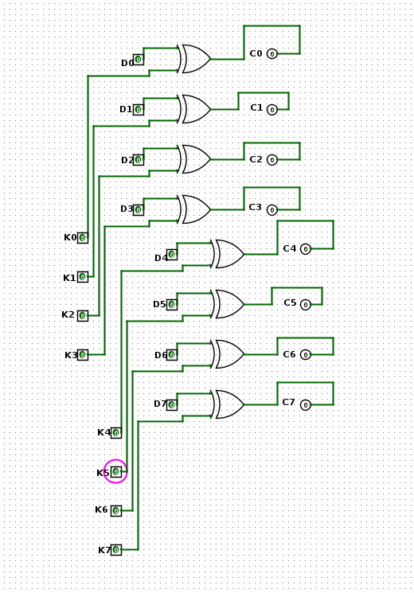

# XOR Cipher in Logisim

Simple 8-bit XOR encryption circuit built in Logisim Evolution.

## Features

- XOR-based encryption
- XOR-based decryption
- 8-bit data input
- 8-bit key input
- ASCII support

## Formula

C = D XOR K

D = C XOR K

## How It Works

Each XOR gate encrypts one bit:

- D = Data
- K = Key
- C = Ciphertext

The same key can decrypt the ciphertext back into the original data.

## Example

Data (ASCII 'I'):
```text
01001001
```

Key:
```text
01010100
```

Ciphertext:
```text
00011101
```

## Usage

1. Open the `.circ` file in Logisim Evolution
2. Use the poke tool to toggle bits
3. Enter data bits (D)
4. Enter key bits (K)
5. Read encrypted output (C)

## Screenshot



## Built With

- Logisim Evolution
